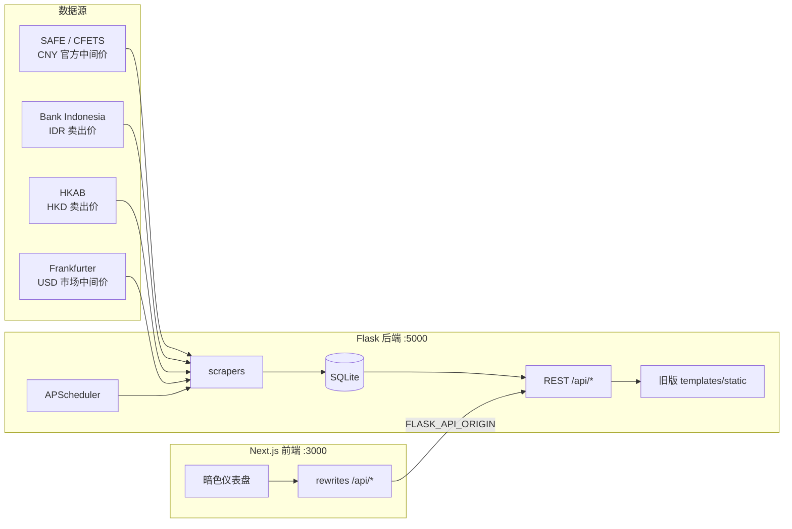

# 汇率数据面板（Exchange Data Panel）

多基座官方汇率采集 + Frankfurter 市场参考 + Next.js 新前端。

本地用 Flask + SQLite 聚合四类汇率数据源，提供 REST API、定时抓取，以及两套 Web 界面：

- **新前端**（`frontend/`）：Next.js App Router + Tailwind 暗色面板（推荐）
- **旧版模板**（`templates/` + `static/`）：仍由 Flask 根路径直接提供

---

## 功能特性

- **四基座并行**：CNY（SAFE 官方中间价）/ IDR（BI 卖出价）/ HKD（HKAB 卖出价）/ USD（Frankfurter 市场中间价）
- **定时抓取 + 启动回填**：APScheduler（`Asia/Shanghai`），断线可补抓
- **REST API**：最新 / 按日 / 区间 / 统一多基座视图 / 手动 crawl / 偏好存储
- **Next.js 暗色仪表盘**：概览卡片 → 详情（表格 / 趋势 / 对比 / 常用币种过滤 / 手动抓取）
- **价格类型隔离**：市场中间价与官方中间价/卖出价分区展示，避免误比绝对水平
- **历史导入工具**：Excel / CSV 导入与 `backfill.py` 回填脚本
- **MIT 开源**，配置经环境变量注入，便于本地与容器化部署

---

## 架构



ASCII 简图：

```
[ SAFE | BI | HKAB | Frankfurter ]
              │
              ▼
     Flask scrapers + scheduler
              │
              ▼
         SQLite (data/)
              │
              ▼
      Flask REST API :5000 ──► 旧版 Web（Flask 根路径）
              ▲
              │ rewrites（FLASK_API_ORIGIN）
              │
      Next.js 前端 :3000
```

---

## 四基座说明

| 基座 | 数据源 | 约货币数 | 价格类型 |
|------|--------|----------|----------|
| **CNY** | 国家外汇管理局（SAFE）/ CFETS | 25 | 官方中间价 |
| **IDR** | Bank Indonesia（BI） | 26 | 官方卖出价 |
| **HKD** | 香港银行公会（HKAB） | 23 | 官方卖出价 |
| **USD** | [Frankfurter](https://frankfurter.dev) | ~49 | **市场参考中间价** |

> **重要**：USD（Frankfurter）为多机构 blended **市场参考中间价**，与 SAFE 官方中间价、BI/HKAB 官方卖出价含义不同。  
> **不要用绝对数值直接对比**「市场中间价 vs 官方中间价/卖出价」。跨基座请优先看相对涨跌或各自时间序列。

---

## 环境要求

| 组件 | 版本 |
|------|------|
| Python | **3.9+** |
| Node.js | **20+**（Next.js 前端） |
| 操作系统 | Linux / macOS / Windows |

---

## 快速开始

### 1. 克隆与 Python 后端

```bash
git clone https://github.com/myyyisbest/exchange-data-panel.git
cd exchange-data-panel

python -m venv venv
source venv/bin/activate        # Windows: venv\Scripts\activate
pip install -r requirements.txt

cp .env.example .env            # 可选；按需改端口、抓取时间等
python app.py
# → http://127.0.0.1:5000  （API + 旧版 Web 面板）
```

首次启动会自动创建 `data/exchange.db`，并在后台回填近期数据。

### 2. Next.js 新前端（推荐）

另开终端：

```bash
cd frontend
cp .env.example .env.local      # 可选；默认已指向 http://127.0.0.1:5000
npm install
npm run dev
# → http://localhost:3000
```

| 服务 | 默认端口 | 说明 |
|------|----------|------|
| Flask | `5000` | API + 旧版 Web；可用 `APP_PORT` 覆盖 |
| Next.js | `3000` | 新前端；`/api/*` 代理到 Flask |

**实时数据与手动抓取依赖 Flask 已启动**；仅开 Next 时页面可打开，但接口会失败。

### 3. 可选：历史导入 / 回填

```bash
python import_excel.py "你的Excel文件路径.xlsx"   # CNY
python import_bi_csv.py                           # IDR
python import_hkd_csv.py                          # HKD
python backfill.py                                # 回填最近数据
python backfill.py --source USD --days 30         # 仅 USD
```

---

## 环境变量

根目录（复制 `.env.example` → `.env`）：

| 变量 | 默认值 | 说明 |
|------|--------|------|
| `APP_HOST` | `0.0.0.0` | 服务监听地址 |
| `APP_PORT` | `5000` | Flask 监听端口（可自定义） |
| `CRAWL_HOUR` | `10` | 每日定时抓取小时（24 小时制） |
| `CRAWL_MINUTE` | `0` | 每日定时抓取分钟 |
| `DB_PATH` | 项目下 `data/exchange.db` | SQLite 路径 |
| `FRANKFURTER_BASE_URL` | `https://api.frankfurter.dev/v2` | Frankfurter API 根（含 `/v2`） |
| `FRANKFURTER_PROVIDERS` | （空） | 可选，逗号分隔限定提供商；空 = 默认 blended |

前端（`frontend/.env.example` → `.env.local`）：

| 变量 | 默认值 | 说明 |
|------|--------|------|
| `FLASK_API_ORIGIN` | `http://127.0.0.1:5000` | Next 服务端 rewrite 目标 |

定时任务时区固定为 `Asia/Shanghai`。USD 与其它基座共用 `CRAWL_HOUR` / `CRAWL_MINUTE`。

---

## API 概览

| 方法 | 路径 | 说明 |
|------|------|------|
| GET | `/api/currencies?base=CNY` | 货币列表（报价方法、单位） |
| GET | `/api/sources` | 全部数据源及币种元数据 |
| GET | `/api/stats` | 各基座统计 |
| GET | `/api/latest?base=CNY` | 最新汇率 |
| GET | `/api/date/2026-06-10?base=CNY` | 指定日期 |
| GET | `/api/prev/2026-06-10?base=CNY` | 上一交易日（算涨跌） |
| GET | `/api/range?base=CNY&start=...&end=...` | 区间查询 |
| GET | `/api/recent?base=CNY&days=30` | 最近 N 天（趋势图） |
| GET | `/api/dates?base=CNY&limit=30` | 最近有数据的日期 |
| GET | `/api/unified/latest` | 多基座统一最新视图 |
| GET | `/api/unified/date/2026-06-10` | 多基座统一指定日期 |
| POST | `/api/crawl` | 手动抓取（body: `source` / `start` / `end`） |
| POST | `/api/crawl-all` | 抓取全部数据源 |
| POST | `/api/backfill` | 回填最近 N 天 |
| GET / POST | `/api/preferences/<base>` | 趋势分析偏好 |
| GET | `/api/_debug/scrape?source=CNY` | 调试原始抓取 |

示例：

```bash
curl 'http://127.0.0.1:5000/api/latest?base=CNY'
curl -X POST http://127.0.0.1:5000/api/crawl-all
curl -X POST http://127.0.0.1:5000/api/crawl \
  -H 'Content-Type: application/json' \
  -d '{"source":"USD"}'
```

通过 Next 开发服务器访问时，浏览器请求同源 `/api/*` 即可（由 rewrites 转发）。

---

## 项目结构

```
exchange-data-panel/
├── app.py                   # Flask 入口（API + 调度）
├── database.py              # SQLite 数据层 / 基座配置
├── scraper.py               # CNY · SAFE / CFETS
├── scraper_bi.py            # IDR · Bank Indonesia
├── scraper_hkab.py          # HKD · HKAB
├── scraper_frankfurter.py   # USD · Frankfurter 市场中间价
├── scheduler.py             # 定时调度与回填
├── backfill.py              # 回填 CLI
├── import_excel.py          # CNY 历史 Excel 导入
├── import_bi_csv.py         # IDR 历史 CSV 导入
├── import_hkd_csv.py        # HKD 历史 CSV 导入
├── download_assets.py       # 旧版前端依赖下载
├── templates/               # 旧版页面（Flask 根路径）
├── static/                  # 旧版静态资源
├── frontend/                # Next.js 新前端（App Router）
│   ├── app/                 # 页面与布局
│   ├── components/          # 概览卡片、表格、趋势、对比等
│   ├── lib/                 # API 客户端
│   ├── next.config.ts       # /api/* → Flask rewrites
│   └── .env.example
├── requirements.txt
├── .env.example
├── LICENSE                  # MIT
└── README.md
```

---

## 截图

当前 PR 对 Next.js 前端做了概览卡片 + 详情面板的视觉/信息架构重设计：

- **概览页**：CNY / IDR / HKD 官方基座卡片 + USD 市场参考分区
- **详情页**：汇率表、涨跌幅、趋势图（Recharts）、多币种对比、常用币种过滤、手动抓取

仓库内暂无预览 PNG。本地启动后打开：

- 新前端：http://localhost:3000
- 旧版面板：http://127.0.0.1:5000

---

## FAQ

**Q：第一次运行没有数据？**  
A：启动后会后台回填近期数据，受上游接口速度影响，请稍候；也可 `POST /api/crawl-all` 或运行 `python backfill.py`。

**Q：Frankfurter（USD）和官方汇率差很多？**  
A：价格类型不同（市场中间价 vs 官方中间价/卖出价），口径、时段、提供商也不同。**勿用绝对水平直接对比**；各自看涨跌趋势即可。

**Q：旧版模板界面还在吗？**  
A：在。Flask 根路径（默认 `:5000`）仍提供 `templates/` + `static/` 旧版 UI；Next.js（`:3000`）是独立新前端，互不影响。

**Q：如何改 Flask 端口？**  
A：设置 `APP_PORT`（或改 `.env`），并把前端 `FLASK_API_ORIGIN` 改成对应地址。

**Q：数据源抓取失败？**  
A：第三方公开接口偶发不稳定属正常。用 `GET /api/_debug/scrape?source=CNY`（或 `IDR` / `HKD` / `USD`）查看原始返回；接口变更时需调整对应 `scraper_*.py`。

**Q：如何修改每日抓取时间？**  
A：环境变量 `CRAWL_HOUR` / `CRAWL_MINUTE`（时区 `Asia/Shanghai`）。

**Q：支持自定义基座吗？**  
A：基座由 `database.py` 的 `BASE_CONFIG` 定义；新增需配套抓取器与表结构。

**Q：数据库文件在哪？**  
A：默认 `data/exchange.db`，可用 `DB_PATH` 自定义（该目录已 gitignore）。

---

## 许可证

[MIT License](./LICENSE)
